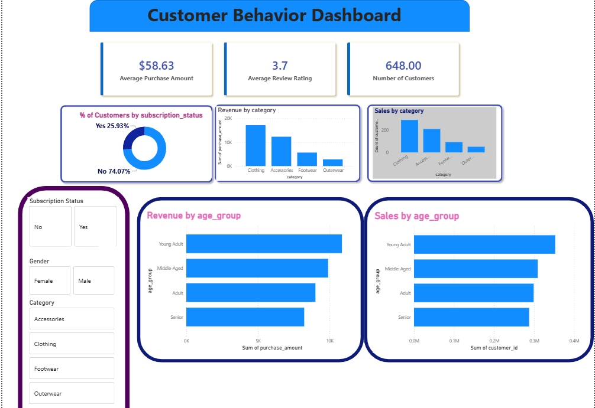

# BehaviorLens — Customer Behavior Analytics

**BehaviorLens** is an end-to-end customer behavior analytics project built using **Python, PostgreSQL, and Power BI**. The project analyzes customer purchasing patterns, segments customers based on behavioral characteristics, and transforms raw transactional data into actionable business insights.

## Project Overview

The objective of BehaviorLens is to understand **who the customers are, how they purchase, what drives their value, and which customer segments require attention**.

The project follows a complete data analytics workflow:

**Raw Data → Python → PostgreSQL → SQL Analysis → Power BI → Business Insights**

Key areas of analysis include:

* Customer purchasing behavior
* Customer segmentation
* Spending and purchase frequency
* Customer loyalty and engagement
* High-value and at-risk customers
* Product and category performance
* Revenue and sales trends

## Tech Stack

| Technology           | Purpose                                                |
| -------------------- | ------------------------------------------------------ |
| **Python**           | Data cleaning, transformation and exploratory analysis |
| **Pandas & NumPy**   | Data manipulation and analysis                         |
| **PostgreSQL**       | Data storage and analytical querying                   |
| **SQL**              | Business analysis and customer segmentation            |
| **Power BI**         | Interactive dashboard and visualization                |
| **Jupyter Notebook** | Data analysis and workflow documentation               |

## 1. Data Preparation & Exploratory Analysis

The raw customer data was analyzed and prepared using Python.

Key steps included:

* Data exploration and profiling
* Data type validation
* Missing-value analysis
* Duplicate detection
* Data cleaning and transformation
* Feature creation
* Exploratory analysis of customer behavior

The cleaned dataset was then prepared for PostgreSQL-based analysis.

## 2. PostgreSQL & SQL Analysis

The processed data was loaded into PostgreSQL to create a structured environment for business analysis.

SQL queries were developed to investigate:

* Customer spending patterns
* Purchase frequency
* Revenue contribution
* Customer segments
* Product/category performance
* Customer loyalty
* Behavioral trends

The analysis converts raw transaction-level data into meaningful customer and business metrics.

## 3. Customer Segmentation

BehaviorLens analyzes customers based on their purchasing behavior to identify meaningful customer groups.

The segmentation helps identify:

* **High-value customers**
* **Frequent customers**
* **Loyal customers**
* **Low-engagement customers**
* **At-risk customers**

These segments can help businesses develop more targeted retention, marketing, and customer engagement strategies.

## 4. Power BI Dashboard

The analytical data was connected to Power BI to build an interactive dashboard for exploring customer behavior and business performance.

The dashboard includes insights around:

* Revenue and sales
* Customer demographics
* Purchase behavior
* Product/category performance
* Customer segments
* Spending patterns
* Key performance indicators

Interactive filters allow users to explore the results across different customer and business dimensions.

## Key Insights

The analysis focuses on translating customer data into actionable business intelligence, including:

* Identifying the customer segments contributing the most value
* Understanding differences in purchasing behavior across segments
* Detecting customers with lower engagement
* Identifying high-performing product categories
* Examining the relationship between purchase frequency and customer value
* Supporting targeted customer retention strategies

## Repository Structure

```text
BehaviorLens/
│
├── Customer_Shopping_Behavior_Analysis.ipynb
│   └── Data cleaning, EDA and preprocessing
│
├── customer_behavior_sql_queries.sql
│   └── PostgreSQL analysis and business queries
│
├── customer_behavior_dashboard.pbix
│   └── Power BI dashboard
│
├── data/
│   └── Dataset files
│
└── README.md
```

## How to Run

### 1. Clone the Repository

```bash
git clone <repository-url>
cd BehaviorLens
```

### 2. Run the Python Notebook

Open:

```text
Customer_Shopping_Behavior_Analysis.ipynb
```

Run the notebook to perform data exploration, cleaning, transformation, and preparation.

### 3. Set Up PostgreSQL

Create a PostgreSQL database and load the processed dataset.

Run:

```text
customer_behavior_sql_queries.sql
```

to reproduce the SQL-based analysis.

## 4. Power BI Dashboard

The processed customer data was visualized in Power BI through an interactive **Customer Behavior Dashboard** designed to analyze purchasing patterns, customer demographics, subscription behavior, and category performance.

<p align="center">
  
</p>

### Dashboard Highlights

* **Key Performance Indicators (KPIs)** including Average Purchase Amount, Average Review Rating, and Total Number of Customers
* **Subscription Analysis** showing the distribution of customers by subscription status
* **Revenue by Category** to compare customer spending across product categories
* **Sales by Category** to analyze customer distribution across product categories
* **Age Group Analysis** comparing revenue and sales across different customer age groups
* **Interactive Filters** for Subscription Status, Gender, and Product Category
* **Customer Behavior Analysis** to identify differences in purchasing patterns across demographic and behavioral segments

The dashboard enables users to interactively filter and explore customer behavior across multiple dimensions, helping identify patterns in **spending, engagement, demographics, subscriptions, and product categories**.
Connect it to the PostgreSQL database and refresh the data if required.

## Skills Demonstrated

* Data Cleaning & Preprocessing
* Exploratory Data Analysis
* Python & Pandas
* PostgreSQL & SQL
* Customer Segmentation
* Business Intelligence
* Power BI Dashboard Development
* KPI Development
* Data Visualization
* Business Problem Solving
* Data-Driven Decision Making

## Project Outcome

BehaviorLens demonstrates a complete, practical analytics workflow that transforms raw customer data into structured analysis and business intelligence.

It showcases the ability to combine **Python, PostgreSQL, SQL, and Power BI** to investigate customer behavior, uncover meaningful patterns, and communicate insights through an interactive dashboard.

---

## License

This project is available under the **MIT License**.
